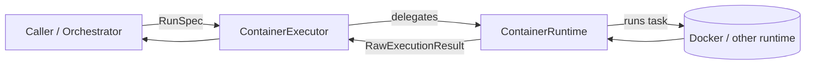

# FastenRun

<p align="center">
  <strong>Execute LLM-generated programs with strict CPU, memory, and time limits.</strong>
</p>

<p align="center">
  
  
  
  
</p>

FastenRun is a small spec-driven runtime layer for one job:

> **run LLM-generated programs in containers without letting them take unlimited CPU, memory, or time.**

It stays intentionally thin:
- you describe **one bounded run**
- FastenRun executes it through a container runtime
- you get back **raw execution facts**
- your orchestration layer decides what those facts mean

---

## The pain

When code is generated by an LLM, the hard part is usually **not** generating it.
The hard part is executing it repeatedly without turning your system into a mess.

Typical problems:

- generated code hangs forever
- it forks too much or burns CPU
- it eats memory
- it prints a lot of output and fails in unclear ways
- Python, Rust, `pytest`, `coverage`, and shell all need to be run the same basic way
- higher-level tools keep mixing **execution**, **judging**, **queueing**, and **reporting** into one fragile blob

---

## Common wrong ways to solve it

### 1. `subprocess.run(...)` directly on the host
Quick to start, hard to trust.

- weak isolation
- easy to leak resources
- hard to keep language/tooling environments clean

### 2. Build a Python-only executor
Looks simple until the next task is:
- Rust
- `pytest`
- `cargo test`
- `coverage json`
- arbitrary shell

Now the API is already wrong.

### 3. Normalize every error too early
Turning everything into `program_error`, `infra_error`, `oom`, `bad_output` sounds clean, but usually throws away useful detail too early.

### 4. Mix runtime with orchestration
If the same layer is responsible for:
- running containers
- interpreting tool output
- retries
- batching
- scoring
- queueing

then the project becomes hard to test and harder to evolve.

---

## The FastenRun approach

FastenRun keeps one sharp boundary:



FastenRun is responsible for:
- describing one bounded run
- executing it
- returning raw facts

FastenRun is **not** responsible for:
- deciding whether `pytest` output means success for your domain
- queueing jobs
- retry policy
- benchmark aggregation
- coverage interpretation
- pass/fail grading logic

That separation is the whole point.

---

## Why this is useful

Because the same contract works for all of these:

- run a Python command
- compile and run Rust
- run `pytest`
- run coverage and emit JSON
- run a formatter or linter
- run a build command
- replay a regression task
- validate an LLM-generated patch
- benchmark repeated executions

You do **not** need a different core runtime model for each one.

---

## Core model

FastenRun centers on **RunSpec**, a generic description of one bounded container run.

```python
from container_exec.models import AcceleratorSpec, MountSpec, ResourceLimits, RunSpec

run = RunSpec(
    image="python:3.12-slim",
    command=("python", "-c", "print(2 + 2)"),
    limits=ResourceLimits(timeout_sec=30, memory="512m", cpus=1.0),
)
```

`RunSpec` can describe:
- image + command
- environment variables
- working directory
- CPU / memory / timeout / pid limits
- network policy
- read-only root filesystem
- bind mounts
- future-facing accelerator requests such as GPU / NPU
- execution user and name

---

## Quick example

```python
from container_exec.models import ResourceLimits, RunSpec
from container_exec.executor import ContainerExecutor
from container_exec.docker_runtime import DockerRuntime
import docker

runtime = DockerRuntime(docker.from_env())
executor = ContainerExecutor(runtime)

result = executor.execute(
    RunSpec(
        image="python:3.12-slim",
        command=("python", "-c", "print(2 + 2)"),
        limits=ResourceLimits(timeout_sec=30, memory="512m", cpus=1.0),
    )
)

print(result)
```

That is the whole idea:
- no task taxonomy in the core
- no semantic interpretation in the runtime
- one bounded container run in, raw execution result out

---

## Full-parameter example

```python
from container_exec.models import AcceleratorSpec, MountSpec, ResourceLimits, RunSpec

run = RunSpec(
    image="my-inference-image:latest",
    command=("python", "score.py", "--batch", "32"),
    env={"MODEL_PATH": "/models/model.bin", "TOKENIZERS_PARALLELISM": "false"},
    working_dir="/workspace",
    limits=ResourceLimits(timeout_sec=90, memory="4g", cpus=2.0, pids_limit=256),
    network_enabled=False,
    read_only_root_fs=True,
    mounts=(
        MountSpec(source="./workspace", target="/workspace", read_only=False),
        MountSpec(source="./models", target="/models", read_only=True),
    ),
    accelerators=(
        AcceleratorSpec(kind="gpu", count=1, exclusive=True),
        AcceleratorSpec(kind="npu", device_ids=("npu0",), vendor="intel"),
    ),
    user="1000:1000",
    name="llm-score-run",
)
```

---

## Supported use cases

FastenRun is meant to be the execution layer for:

- Python commands
- Rust compile-and-run commands
- `pytest`
- coverage report generation
- arbitrary shell commands
- repeated execution for benchmarking
- batch orchestration by a higher-level system
- compile/build verification
- linting and static checks
- formatting checks
- code grading with external pass/fail logic
- regression replay against stored tasks
- generated patch validation
- sandboxed reproduction of failures
- multi-language LLM-generated code evaluation

---

## Supported today vs planned

### Supported today

- one bounded container run described by `RunSpec`
- raw result reporting via `RawExecutionResult`
- Docker-based runtime adapter
- forwarding of:
  - `image`
  - `command`
  - `env`
  - `working_dir`
  - CPU / memory / timeout / pid limits
  - network on/off
  - read-only root filesystem
  - bind mounts
  - `user`
  - `name`
- no interpretation of tool semantics such as `pytest`, `coverage`, `cargo`, or compiler output

### Planned / contract-only for now

- accelerator-aware execution (`accelerators`) such as GPU / NPU binding
- end-to-end examples that execute real Python, Rust, and pytest tasks under Docker
- optional higher-level task builders layered on top of `RunSpec`
- orchestration concerns such as retries, batching, queueing, and worker pools

---

## Why the project is small on purpose

FastenRun is trying to be a reliable **core**, not a kitchen-sink framework.

If you want:
- job queues
- notebooks
- Kafka workers
- evaluation pipelines
- coverage analyzers
- benchmark aggregators
- grading logic

those should sit **on top of** FastenRun, not inside it.

That keeps the runtime testable and keeps your higher-level system free to evolve.

---

## Examples

See `examples/use_cases.py` for examples covering:
- Python
- Rust
- `pytest`
- coverage JSON
- arbitrary shell
- compile verification
- lint
- formatting check
- repeated benchmark task
- code grading
- regression replay
- generated patch validation
- sandboxed failure reproduction
- a dedicated **ALL_PARAMETERS_RUNSPEC** example showing every `RunSpec` parameter
